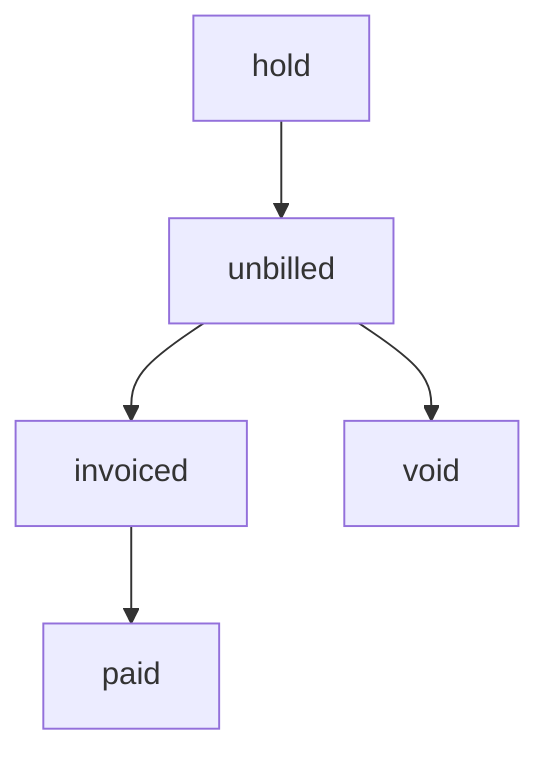

# CONTRATO OFICIAL DEL SISTEMA - FACTURACIÓN
**VERSIÓN ESTABLE - INMUTABLE**

> [!IMPORTANT]
> Este documento es la ley supreMA para el sistema de facturación. Cualquier desviación es un bug crítico.

## [1] FUENTE DE VERDAD DEL DINERO
- **Columna Única**: `price_cents`
- **Reglas**:
    - NO puede ser NULL.
    - DEBE ser > 0.
    - PROHIBIDO el uso de `amount_cents`.
    - PROHIBIDO fallbacks o valores hardcodeados.

## [2] ESTADOS DE TICKETS
- **VÁLIDOS**: `hold`, `unbilled`, `invoiced`, `paid`, `void`
- **PROHIBIDOS**: `billable`, `unpaid`, `pending`

## [3] FLUJO DEL SISTEMA


## [4] FACTURACIÓN (QUERY OFICIAL)
- **Filtro**: `WHERE billing_status = 'unbilled'`
- **Restricciones**:
    - NO usar `IN (...)`.
    - NO incluir estados legacy.

## [5] INVOICE_ITEMS (PROTECCIÓN)
- **Restricción**: `UNIQUE(ticket_id)`
- **Regla**: Un ticket solo puede facturarse UNA vez.

## [6] JOBS_QUEUE (IDEMPOTENCIA)
- **Campo**: `idempotency_key`
- **Índice**: 
  ```sql
  CREATE UNIQUE INDEX uniq_job_idempotency 
  ON jobs_queue (idempotency_key) 
  WHERE idempotency_key IS NOT NULL;
  ```
- **Regla**: Misma clave = mismo job = no duplicados.

## [7] INVOICES (TIEMPO)
- **Columnas**: `created_at`, `updated_at`, `paid_at`
- **Regla**: Toda actualización DEBE modificar `updated_at`.

## [8] JANITOR JOB
- **Condición**:
    - `status = 'charging'`
    - `updated_at < NOW() - INTERVAL '1 hour'`
    - `paid_at IS NULL`
- **Acción**: `status` → `'retrying'`

## [9] REGLAS ABSOLUTAS
1. No crear nuevas columnas sin autorización.
2. No usar columnas eliminadas.
3. No usar estados legacy.
4. No usar fallback de precios.
5. No duplicar lógica de cálculo.
6. No usar `IN (...)` en facturación.
7. No asumir datos.

## [10] PRINCIPIO RECTOR
La base de datos es la única fuente de verdad. El código no interpreta, no adivina y no parchea.
